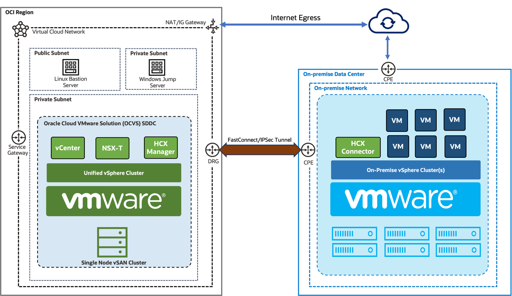

# Intelligent Cloud Operations with OCI Gen AI and AI Agents

**Estimated time:** 2 Hours

## Workshop Introduction

The workshop walks you through deploying and validating an Intelligent Cloud Operations Agent on OCI.

In this hands-on LiveLab, you will design, deploy, and interact with an intelligent Cloud Operations agent powered by Oracle Cloud Infrastructure (OCI) AI services. The agent leverages Retrieval-Augmented Generation (RAG), custom tools, and an MCP (Model Context Protocol) server to translate natural language queries into actionable cloud operations.

You will provision infrastructure using Terraform and OCI Resource Manager, deploy containerized services via OCIR, and configure an AI agent capable of performing real-world cloud operations tasks such as querying resources, troubleshooting environments, and automating workflows.

By the end of the workshop, you will have a fully functional AI-driven Cloud Operations assistant that integrates with OCI services, demonstrating how generative AI can transform cloud operations, improve productivity, and reduce manual effort.

We will cover the following topics as part of the upcoming labs:

* Deploying the Infrastructure Stack with OCI Resource Manager
* Building and pushing the MCP Server and Application Server container images
* Configuring Network Security List for Application and MCP Server configuration
* Deploying the runtime Application Stack
* Validating the application through the UI and test VMs

## Architecture

As part of the workshop, we will be building a sample AI Application backed by OCI Gen AI Agent with RAG Tool, OCI Gen AI Service and LanGraph.

### Prerequisites

The lab makes following assumptions:

- Familiarity with Oracle Cloud
- Oracle Cloud Account with Chicago Region Subscribed
- Basic OCI Knowledge
- Command Line & DevOps Basics
- Terraform / Infrastructure-as-Code Familiarity
- Containerization Knowledge
- Networking Basics
- Generative AI Fundamentals

## Learn More

* [Oracle Cloud](https://www.oracle.com/cloud/)
* [OCI Generative AI Services](https://docs.oracle.com/en-us/iaas/Content/generative-ai/home.htm)
* [OCI Generative AI Agents](https://docs.oracle.com/en-us/iaas/Content/generative-ai-agents/home.htm)
* [OCI Container Instances](https://docs.oracle.com/en-us/iaas/Content/container-instances/home.htm)
* [OCI Container Registry](https://docs.oracle.com/en-us/iaas/Content/Registry/home.htm)

## Acknowledgements

* **Author:** Vijay Kumar, Cloud Engineering
* **Contributors:**
    - Nikhil Verma, Cloud Engineering

* **Last Updated By/Date:** Vijay Kumar, Cloud Engineering, May 2026